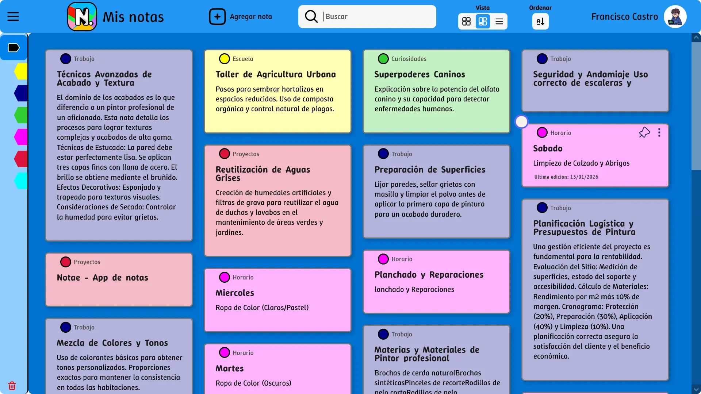
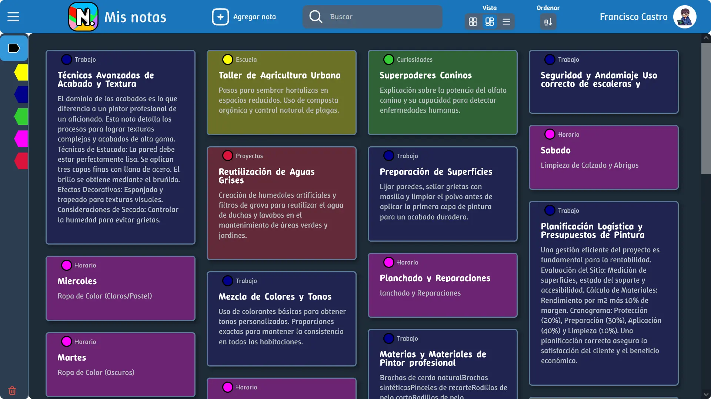

# 📝 Notae - Notas Web Premium



[](https://opensource.org/licenses/MIT)
[](https://nodejs.org/)
[](https://vitejs.dev/)

**Notae** es una aplicación de gestión de notas diseñada para ofrecer una experiencia fluida, rápida y organizada. Combina la potencia de un backend en la nube con la resiliencia del almacenamiento local, permitiéndote capturar ideas sin interrupciones.

> [!TIP]
> **[➡️ Ver Demo en Vivo](https://notae-notes.vercel.app/)** *(Próximamente)*

---

## 🎬 Demo en Acción

Mira cómo Notae facilita la organización de tus ideas con una interfaz fluida y animaciones premium.

<div align="center">
  <video src="./assets/demo.mp4" width="100%" muted autoplay loop poster="./assets/preview.png">
    Tu navegador no soporta videos. Puedes ver la demo en <code>./assets/demo.mp4</code>
  </video>
</div>

---

## ✨ Características Principales

### 🧠 Organización Inteligente
- **Gestión por Grupos:** Clasifica tus notas en categorías personalizables con colores.
- **Sistema de Fijado (Pin):** Mantén tus notas más importantes siempre al alcance en la parte superior.
- **Búsqueda y Filtros:** Encuentra rápidamente lo que buscas mediante filtros dinámicos por grupo o contenido.

### 🔄 Sincronización Híbrida
- **Offline-First con Dexie.js:** Tus notas se guardan instantáneamente en tu navegador usando IndexedDB. Sigue trabajando incluso sin conexión.
- **Sincronización en la Nube:** Al iniciar sesión con Google (OAuth 2.0), tus notas se sincronizan automáticamente con nuestra base de datos MongoDB.

---

## 📸 Galería de Interfaz

| Sesion con sincronizacion de datos | Modo Oscuro Premium |
|:---:|:---:|
|  |  |

---

## 🛠️ Stack Tecnológico

### Frontend
- **Lenguaje:** JavaScript (ES6+) Moderno.
- **Herramienta de Construcción:** [Vite](https://vitejs.dev/).
- **Persistencia Local:** [Dexie.js](https://dexie.org/) (IndexedDB).
- **Layout & Drag:** [Muuri](https://muuri.dev/) & [SortableJS](https://sortablejs.com/).
- **Seguridad:** DOMPurify para limpieza de contenido.

### Backend
- **Entorno:** [Node.js](https://nodejs.org/).
- **Framework:** [Express.js](https://expressjs.com/).
- **Base de Datos:** [MongoDB](https://www.mongodb.com/) con Mongoose.
- **Autenticación:** [Google OAuth 2.0](https://developers.google.com/identity) & JSON Web Tokens (JWT).
- **Notificaciones:** [Nodemailer](https://nodemailer.com/).

---

## 📂 Estructura del Repositorio

El proyecto utiliza una arquitectura desacoplada para facilitar el escalado y mantenimiento:

```text
notae-notes-app/
├── frontend/         # SPA desarrollada con JavaScript puro y Vite.
├── backend/          # API RESTful con Node.js y Express.
├── .env.example      # Plantilla para variables de entorno globales.
└── package.json      # Scripts de orquestación del proyecto.
```

---

## 🚀 Instalación Local

### Requisitos Previos
- Node.js (v18 o superior)
- MongoDB (Local o Atlas)

### ⚡ Inicio Rápido (Windows)
Si estás en Windows, puedes usar el script automatizado en la raíz del proyecto:
```bash
./iniciar-proyecto.bat
```
Este script instalará las dependencias (si es necesario) y arrancará tanto el frontend como el backend en terminales separadas.

### 1. Preparación del Backend
1. Navega a `backend/`.
2. Instala dependencias: `npm install`.
3. Crea un archivo `.env` basado en `.env.example`.
4. Inicia el servidor: `npm run dev`.

### 2. Preparación del Frontend
1. Navega a `frontend/`.
2. Instala dependencias: `npm install`.
3. Configura `VITE_API_BASE_URL` en tu archivo `.env`.
4. Inicia el cliente: `npm run dev`.

---

## 📧 Contacto y Contribución

¿Tienes ideas para mejorar Notae? ¡Me encantaría escucharlas!

- **Desarrollador:** Ubaldo O.
- **Email:** [fco.castro.dev@gmail.com](mailto:fco.castro.dev@gmail.com)
- **LinkedIn:** [Francisco Castro.](https://www.linkedin.com/in/francisco-c-887613384)

---

## 📄 Licencia

Este proyecto está bajo la Licencia MIT. Consulta el archivo `LICENSE` para más detalles.
